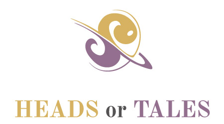

# Welcome
Heads or Tales is a social choose your path tale you can share with your family and friends. That means you don't just choose the path in a tale; you collaberate to help create the paths in the tale.

Also, you don't need to install any software on your computer. You just need to download the files and you can enjoy the journey online or off.

## Are you new to GitHub
You look at the interface with all the buttons with code tab and pull requests. You don't understand all of this. Don't panic. You can choose from the options below to help on this journey.

### You want to read the tale
Go to [Heads or Tales](https://stoddard-david.github.io/heads-or-tales/) to read the tale. As updates are made the site will update.

### You want a copy of the tale to read
Go to the green button 'Clone or Download' and select 'Download Zip' from the options. Exact the folder. You can then open the folder. Then double click on index.html. This will open the file in your browser for you to enjoy.

*To update to the latest version, delete the folders on your computer and re-download the files.*

### You want help collabrate on the tale
You can help me improve the tale. Read the story and locate spelling and grammar issues. 

Go to GitHub to create a new account. Go to the 'Issues' and create/add to issues. When creating an issue let me know what page has the error.

Also follow updates and what is being worked on by reading the issues.

You can also go to the Facebook page to help choose the direction of the tale.

## What is included
* HTML
* CSS
* JavaScript
* Images
* Typography files
